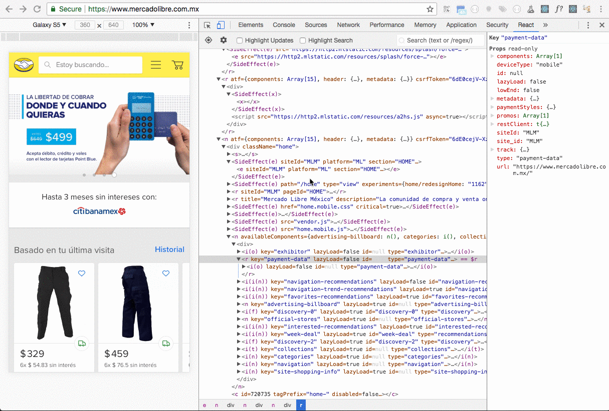

# 🛠️ Tips y experiencias

Para concluir este workshop, nos gustaría contarte un poco la experiencia que hemos tenido con React js, y algunas cosas que nos gustaría comentarte para que las tengas en cuenta, para que puedas seguir aprendiendo React.

## Server side Rendering

React JS tiene la particularidad de que permite realizar renders a markups estáticos, lo cual es realmente útil si queremos que el procesamiento y el render de los componentes lo realice el servidor y que no sea un esfuerzo extra para el cliente de hacerlo. Si nuestro servidor puede realizar ese procesamiento previo por nosotros, ganaremos en performance y experiencia en el cliente.

Para hacer uso de esta feature recomendamos usar Node JS, un server completamente en JS, que les va a permitir realizar esto sin mucho esfuerzo. Principalmente existen dos métodos importantes de React que están involucrados en esta feature:

* renderToString: este método permite convertir un componente en HTML estático.
* hydrate: método que se utiliza desde el lado del cliente, para dar vida al markup generado desde backend. Básicamente este método lee el Markup generado, y agrega los eventos necesarios, ya sea eventos de lifecycle o callbacks.

Esta funcionalidad también es útil ya que React al ejecutar hydrate, hace una validación del que Markup generado en el server como en el client sean iguales. En caso de que no sean, nos alertará de que son diferentes y lo deberíamos tomar como un error.

Para aprender un poco más de estas cosas, podés seguir estos links:

* [renderToString](https://reactjs.org/docs/react-dom-server.html#rendertostring)
* [hydrate](https://reactjs.org/docs/react-dom.html#hydrate)

## React dev tools

Encontrar errores y analizar aplicaciones hechas con React puede parecer sencillo cuando vemos los componentes y el código, pero a la hora de ver estos componentes funcionando del lado del cliente, a veces no es tan sencillo ver donde comienza un componente y termina otro, así como también ver que props recibe un componente. Obviamente podemos hacer uso del console.log, pero existe otra alternativa :\)

{% embed data="{\"url\":\"https://github.com/facebook/react-devtools\",\"type\":\"link\",\"title\":\"facebook/react-devtools\",\"description\":\"react-devtools - An extension that allows inspection of React component hierarchy in the Chrome and Firefox Developer Tools.\",\"icon\":{\"type\":\"icon\",\"url\":\"https://github.com/fluidicon.png\",\"aspectRatio\":0},\"thumbnail\":{\"type\":\"thumbnail\",\"url\":\"https://avatars0.githubusercontent.com/u/69631?s=400&v=4\",\"width\":400,\"height\":400,\"aspectRatio\":1}}" %}

React dev tools es una extensión de chrome y firefox que permite analizar las jerarquías de componentes de React, así como también las props que reciben estos componentes.

## Performance

Usualmente las aplicaciones de React son rápidas de por sí, pero cuando estas comienzan a escalar, puede suceder que sea necesario realizar algunos ajustes para ganar en performance y usabilidad. Aquí les dejamos algunos criterios y consejos que pueden resultar útiles a tener en cuenta.

### Usar shouldComponentUpdate 

Este método del ciclo de vida de React es muy importante en este aspecto, ya que nos permite controlar si el componente necesita actualizarse y realizar el render una vez más. En React.Component, este método devuelve siempre true, por lo cual cualquier cambio en el state o en props va a causar un render nuevamente. En caso de que tengamos props o variables en el state que no impactan en el render del componente, podemos implementar este método y hacer la evaluación del state o de las props que si sabemos que llevan a una actualización del componente. 

De la mano con esto, podemos hacer que las variables que estamos guardando en el state pero no afectan al render pasen a estar a nivel de clase, y de esta manera evitamos el rerender en caso de que se actualicen

### Pure Components

De la misma manera que exportamos React.Component, podemos hacer uso de React.PureComponent. La diferencia entre estos tipos de componentes es que PureComponent si implementa shouldComponentUpdate, y realiza una comparación shallow de las props y del state.

Para una lectura más avanzada y con ejemplos reales de optimización de Performance, pueden leer el siguiente artículo por el equipo de AirBnb:

{% embed data="{\"url\":\"https://medium.com/airbnb-engineering/recent-web-performance-fixes-on-airbnb-listing-pages-6cd8d93df6f4\",\"type\":\"link\",\"title\":\"React Performance Fixes on Airbnb Listing Pages\",\"description\":\"There may be low-hanging fruit 🥝 affecting performance in areas you might not track very closely but are still important.\",\"icon\":{\"type\":\"icon\",\"url\":\"https://cdn-images-1.medium.com/fit/c/304/304/1\*MlNQKg-sieBGW5prWoe9HQ.jpeg\",\"width\":152,\"height\":152,\"aspectRatio\":1},\"thumbnail\":{\"type\":\"thumbnail\",\"url\":\"https://cdn-images-1.medium.com/max/1200/0\*ZPHyNBzpm6oT1dqu.\",\"width\":1148,\"height\":515,\"aspectRatio\":0.44860627177700346}}" %}

